# Gitops on Docker Swarm with Portainer
On `Kubernetes`. We have `Flux` and `ArgoCD` for `gitops`, so how about `Docker Swarm`.

This is a demonstration `gitops` on `Docker Swarm` using `Portainer`
## 1. Prerequisites
* A `GCP` account.
* [ansible](https://docs.ansible.com/ansible/latest/installation_guide/intro_installation.html)
* [terraform](https://developer.hashicorp.com/terraform/tutorials/aws-get-started/install-cli)

## 2. Let's go
### 1. Configure environment variable
Please replace with your `projectId` and `ssh_key` from output to `inventory`
```
export TF_VAR_projectId=$projectId
export TF_VAR_ssh_key=$ssh_key
```

### 2. Initialize infrastructure

```
terraform init
```

```
terraform apply --auto-approve
```

### 3. Execute ansible
Please replace with your `real ip` from output to `inventory`
```
sh ./ansible.sh
```

### 4. Install portainer
```
sh ./portainer.sh
```

Output:
```
TASK [Print location] **************************************************************************************************************************************************************************************
    "msg"éé: [
        "ID             NAME                    IMAGE                           NODE               DESIRED STATE   CURRENT STATE               ERROR     PORTS",
        "lvz2dc7pe5m8   portainer_portainer.1   portainer/portainer-ce:2.19.4   master1-instance   Running         Running about a minute ago             "
    ]
}

ok: [master1-instance] => {
```

Copy the `real ip` of node which is running `portainer-portainer` and access it in port `9000` like this: **IP:9000**

### 5. Create a source git repo
You can create a repo any where from `github`, `gitlab`, `bitbucket`,...

Add contents from `source` folder to that repo:

Eg: [nginx-portainer](https://github.com/hqdNotional/nginx-portainer)
### 6. Gitops with repository
View stack:
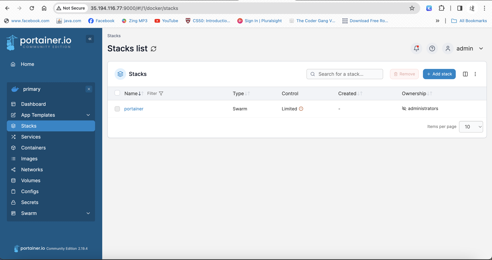
Add new stack:

Enter `name`, `Build method`, `Repo URL`, `Repo ref`, `Compose path`:
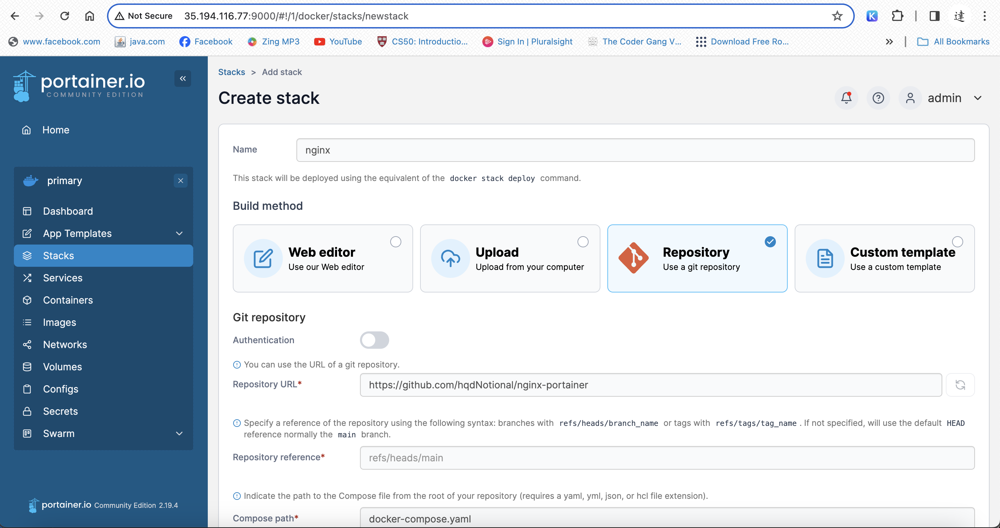
Fill `GitOps updates`
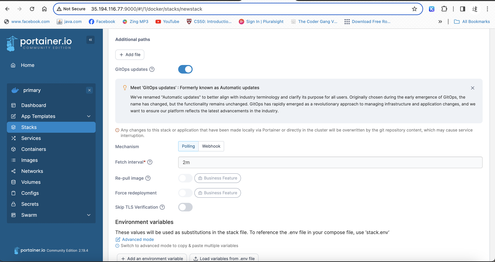
Fill `Access control`
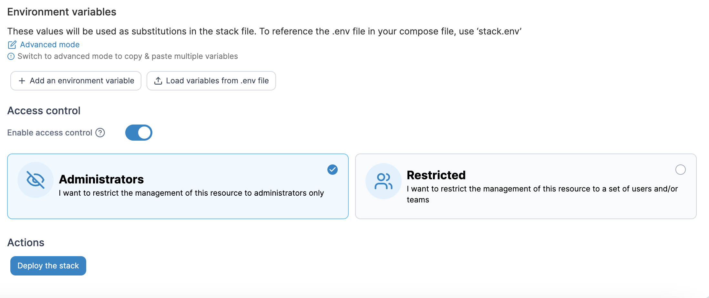
Wait:
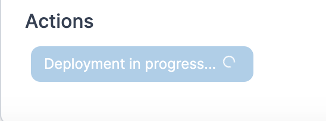
Check notification:
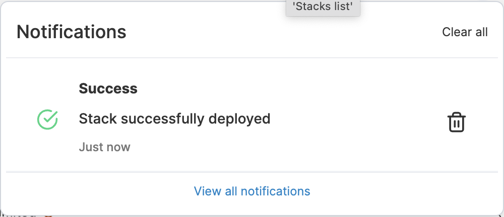
Stack overview:

version overview: `v1.14.2`
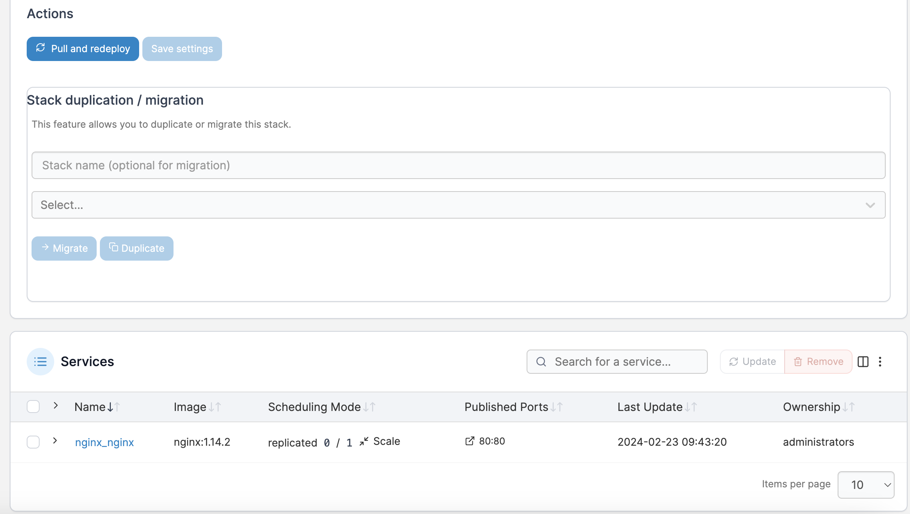
Edit `compose file`:
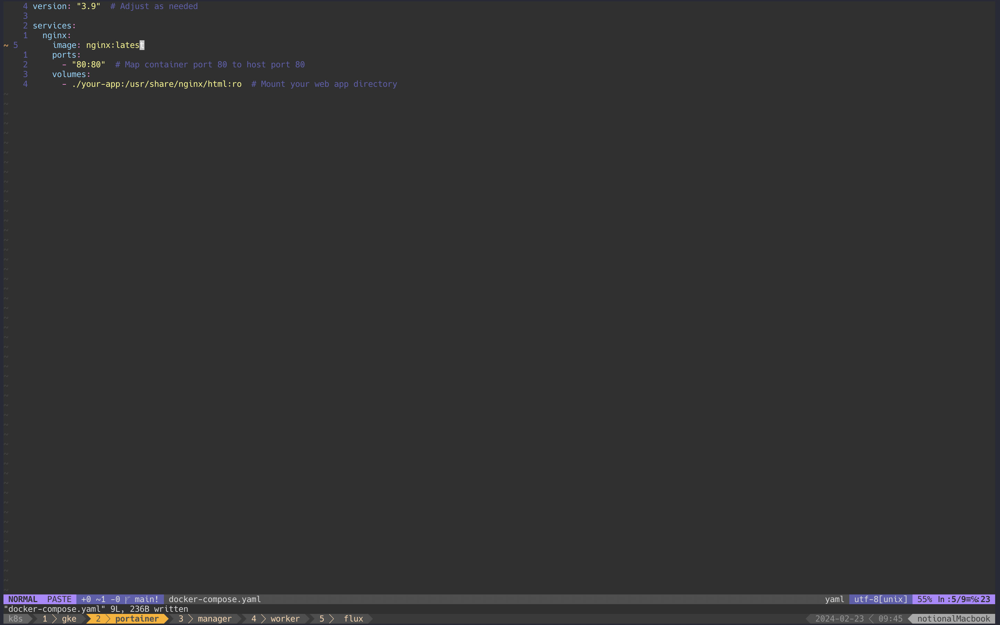
Diff `compose file`:
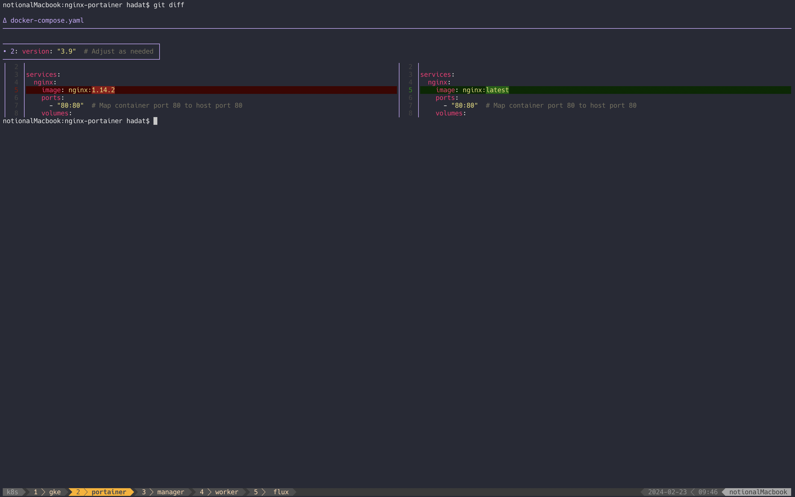
Commit :
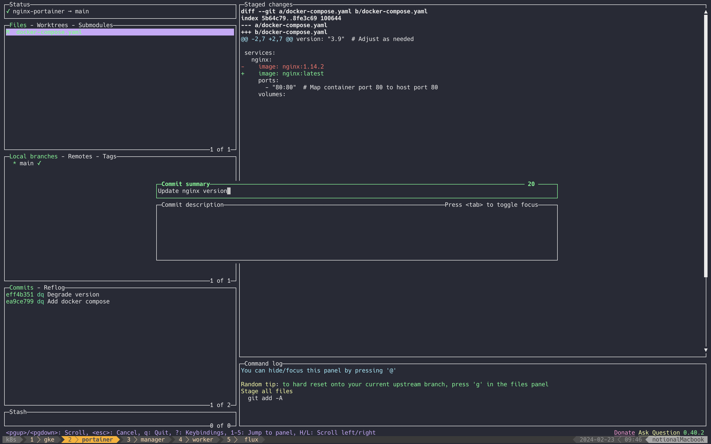
Push :
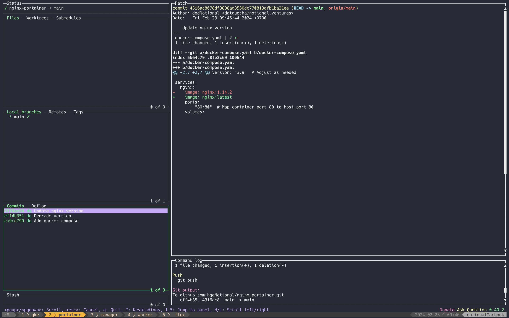
Version updated:
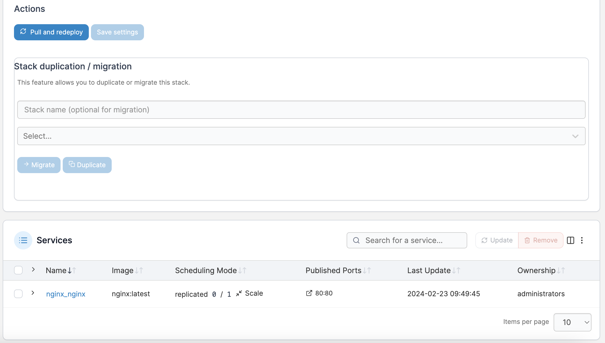

### 7. Destroy infrastructure
```
terraform destroy --auto-approve
```
